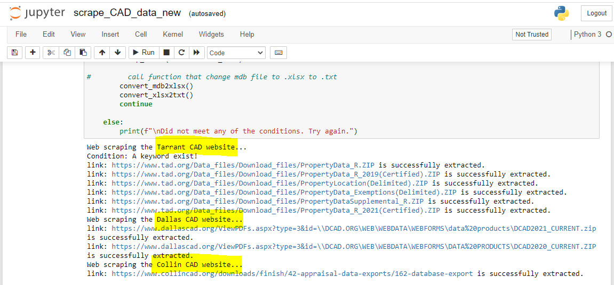
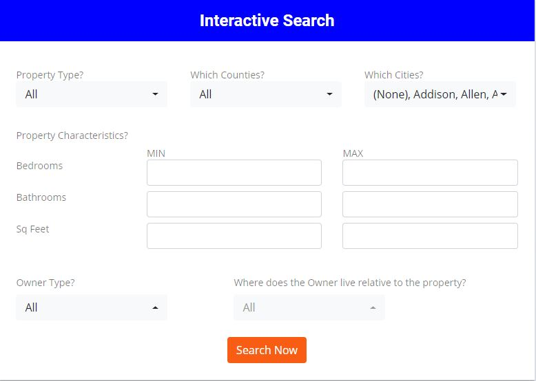
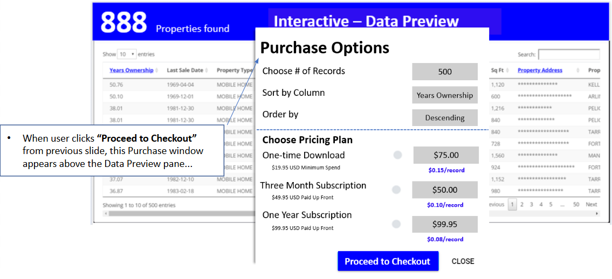

## 🏡 Behind the Scenes: Scraping Property Data That Powers a Web App

As a **Freelance Python developer** at REI Data Connect, I built the automation pipeline that extracts and prepares real estate property data from public sources to feed directly into the platform’s interactive web application. My work focused on scraping, transforming, and loading public records into a database that powers the web app’s search and checkout features.

### 🔧 My Contributions

- **Automated Scraping Pipeline**  
  I developed a robust Python-based scraper that pulls structured datasets from county appraisal district (CAD) websites, including Tarrant, Dallas, and Collin counties.

    
  *Example: Scraping multiple ZIP files from county websites and extracting them into usable formats.*

- **Backend Data Preparation and Loading**  
  Extracted property data is converted and normalized before being automatically inserted into the platform’s backend database. This enables the frontend UI to display live and searchable property information without manual updates.

- **Enabling Frontend Filters and Dynamic Search**  
  The scraped and processed data feeds into the **Interactive Search** UI, where users can filter by county, city, square footage, owner type, and more.

    
  *Interactive filtering powered by the database I populated through automated scraping.*

- **Powering Data Preview and Checkout Options**  
  Once a user filters and views matching properties, they can sort, preview, and purchase records through the app's checkout system.

    
  *Final stage: users choose pricing tiers and download structured real estate data.*

### ✅ Outcome

- Enabled reliable and repeatable backend data refresh with no manual intervention.
- Expanded coverage across 3 major counties and improved data availability for thousands of records.
- Supported a scalable business model by automating data delivery into a client-facing e-commerce system.

