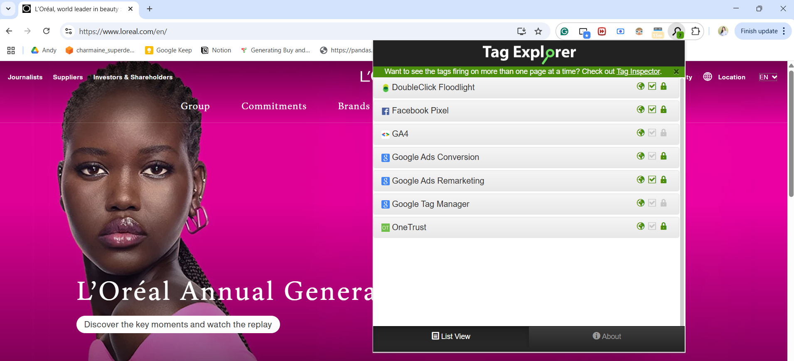
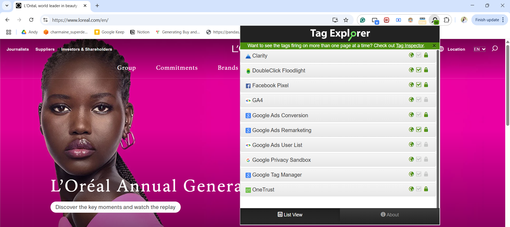

## 🏗 Enhancing Tag Detection Accuracy at InfoTrust

As part of the team behind InfoTrust’s proprietary tools, I contributed directly to the enhancement and maintenance of the **Tag Library**, which powers both [TagInspector](https://taginspector.com) and the [Tag Explorer Chrome Extension](https://taginspector.com/articles/introducing-tag-explorer/).

My responsibilities included:

- **Identifying and categorizing tracking technologies** such as tags, pixels, and beacons
- **Researching unknown or undocumented tracking tools** to assign them to the correct vendor (e.g., Microsoft Clarity, OneTrust, Google Ads)
- **Updating and maintaining the Tag Library**, ensuring that industry changes and new tools were reflected in real-time scanning

🚀 **Impact**:  
Through consistent audits and proactive research, I led improvements that **increased the number of tags accurately detected and described by 20%**, helping enterprise users better understand what tools were loading on their websites.

🔍 **Before vs. After Comparison**:

### ✅ Before Tag Library Update:

  
Tags Detected: GA4, Facebook Pixel, Google Tag Manager, Google Ads Conversion, etc.

---

### 🔄 After Tag Library Update:

  
**New Tags Detected:**

- Microsoft **Clarity**
- **Google Ads User List**
- **Google Privacy Sandbox**

These tags were previously unrecognized by the tool and are now actively tracked thanks to our improved tagging logic and vendor matching.

🧠 **Interesting Finding**:  
Many modern marketing platforms, especially privacy-focused solutions like Google Privacy Sandbox, were firing scripts that mimicked others or went unclassified due to subtle behavior differences. Recognizing and labeling these tags allowed for better visibility and compliance tracking for our clients.

